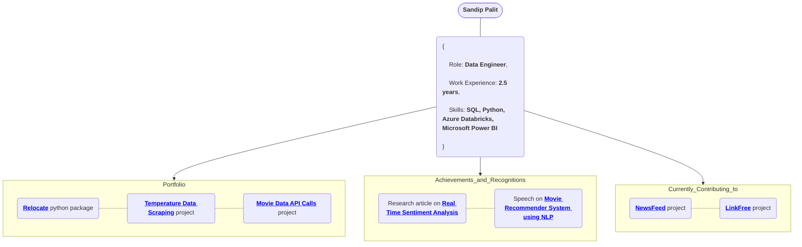
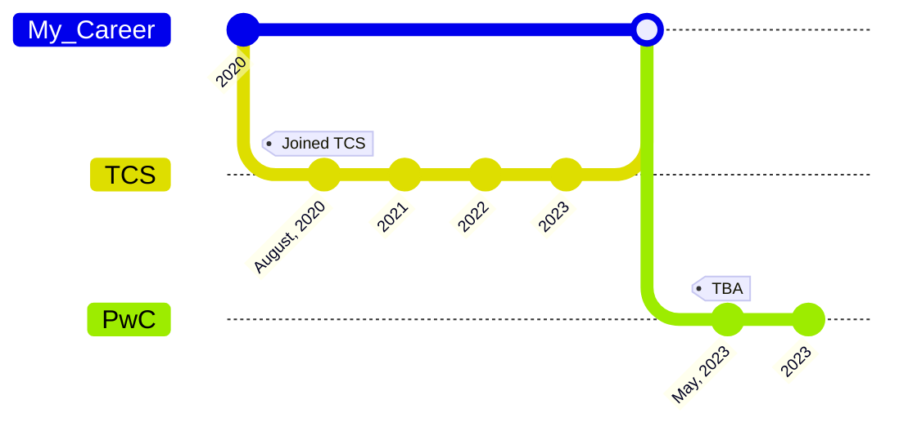

## My Career Journey

## My Github Stats

## Connect with me

&nbsp;&nbsp;&nbsp;&nbsp;
&nbsp;&nbsp;&nbsp;&nbsp;
&nbsp;&nbsp;&nbsp;&nbsp;
&nbsp;&nbsp;&nbsp;&nbsp;
&nbsp;&nbsp;&nbsp;&nbsp;

<h5 align="center">Show some ❤️ by giving some ⭐ to my repositories! </h5>
